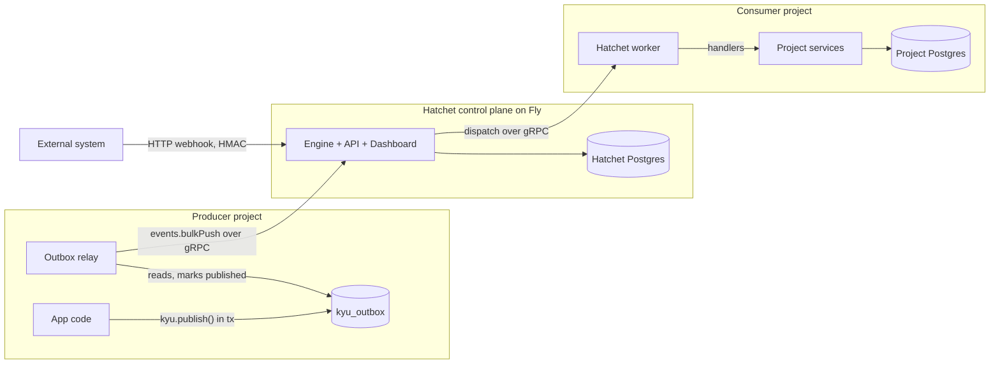

# Kyu — Requirements and Design

The company message bus, built on self-hosted Hatchet.

| | |
|---|---|
| Status | Draft v0.2 for review |
| Author | Matt Demler (drafted with Claude) |
| Date | 16 September 2026 |
| Decision owner | Matt |
| Reviewers | Product reviewer, architecture reviewer |

## 1. Purpose

Build one message bus, owned by the company and run as its own system, that every internal project can publish to and consume from. The bus carries three kinds of traffic:

- **Events**: facts that happened in a producer, fanned out to any number of subscribers ("order placed").
- **Commands**: work that must be done exactly by one handler, retried until it succeeds or is parked ("send invoice").
- **Workflow orchestration**: multi-step, long-running processes with waits, timers and event correlation (a consumer's workflow engine).

The engine is [Hatchet](https://github.com/hatchet-dev/hatchet), self-hosted. Everything company-specific lives in a thin SDK and a set of conventions on top of it. This document is the requirements and the design for that system.

**Name.** Kyu sounds like queue, and the kanji 急 (kyū) means urgent or express, as in express delivery. The kanji is the logo. A message is express: it is delivered promptly to the consumers that subscribed, and nowhere else. That is what this system does for messages. The name is short and industry-neutral, so a project in any industry can adopt it without the name pointing at another product.

## 2. Context

### 2.1 The problem this solves

Each company project that needed background work grew its own private job queue: a table or a library, claimed by a worker inside the project's own process, with its own retry, dedupe and scheduling rules. Interval processors started from the API boot file run alongside the queue and outside it.

None of these projects has domain events. Every fan-out is hand-wired at a post-commit seam: a service commits, then calls one dispatcher after another. A dispatch that runs in-process is lost when the process crashes between the commit and the call. A dispatch that is queued dodges the read-before-commit race by delaying its job with a fixed wait, which is a guess rather than a guarantee.

Because every queue is private to its project, no project can subscribe to another project's facts. A second project that needs to react to the first project's data has no seam to attach to, and a workflow engine built on one project's queue cannot be reused by the next.

### 2.2 Decisions already made

- 7 Sep 2026: keep an existing Postgres queue for one third-party integration and defer BullMQ. Every interaction with that third party stays routed through the queue with an ops ledger and a wire log.
- 15 Sep 2026: build the bus as a standalone company system, not as a library extracted from any one project. Consumers use it for events, outbound integration commands and workflow orchestration.
- 16 Sep 2026: engine is Hatchet, self-hosted, MIT-licensed. BullMQ was rejected because it has no topics, no correlation waits, and per-key ordering is a paid feature. Postgres-only alternatives (pg-boss) cover less.

### 2.3 Terminology

| Term | Meaning |
|---|---|
| Producer | A project that writes events or commands to the bus |
| Consumer | A project that runs a Hatchet worker subscribing to bus messages |
| Bus tenant | A Hatchet tenant. One per company project. Not a business tenant |
| Business tenant | A customer organisation in the producer's own model. Carried as message metadata |
| Envelope | The company-standard wrapper around every message |
| Outbox | A table in the producer's own database where messages are written transactionally before the relay ships them |

## 3. Goals and non-goals

### Goals

1. One bus, one contract, usable from any company project in TypeScript first and other Hatchet SDK languages (Python, Go, Ruby) without a dependency on any other project.
2. A producer never loses a message once its own database transaction commits.
3. A consumer can be added to an event without touching the producer.
4. Every message and every attempt is visible in one place, with replay.
5. A consumer can retire its private queue, interval processors and hand-wired dispatchers one job type at a time.
6. Domain knowledge (a producer's entities and their rules) stays out of the bus.

### Non-goals

- Synchronous request/response lookups against third-party APIs. These stay in-request behind a shared HTTP client. The bus is for side effects and orchestration.
- Replacing a consumer's domain ledgers (an integration ops ledger, a wire log). They stay as the domain-level record and link to bus runs.
- Streaming, replayable logs à la Kafka. Hatchet retains run history for observability, not as a source of truth.
- Multi-region or high-availability topology in the first release.

## 4. Requirements

Priority uses MoSCoW: M must, S should, C could.

### 4.1 Functional

| ID | Requirement | Pri |
|---|---|---|
| F1 | A producer can publish an event by name with a typed payload; all subscribers of that name receive it | M |
| F2 | A producer can send a command by name; exactly one handler processes it | M |
| F3 | Publishing is atomic with the producer's database transaction: rolled back with it, never lost after commit | M |
| F4 | A consumer subscribes by declaring a handler for a message name, with no change to the producer | M |
| F5 | A subscriber can filter which instances of an event it receives by a payload expression | S |
| F6 | Delivery is at-least-once; the envelope carries a stable id so consumers can deduplicate | M |
| F7 | Failed handlers retry with exponential backoff; a handler can mark an error as non-retryable | M |
| F8 | After retries are exhausted the run is marked failed, is alertable, and can be replayed from the UI | M |
| F9 | Consumers can request per-key serialisation (FIFO per order id, per customer id) | M |
| F10 | Consumers can request coalescing: "only the newest run for this key matters" and "drop if one is already running for this key" | M |
| F11 | Messages can be delivered after a delay, and handlers can be scheduled by cron | M |
| F12 | A long-running handler can sleep durably and wait durably for a correlated future event, surviving restarts | M |
| F13 | Handlers can be prioritised (interactive ahead of bulk) | S |
| F14 | Handlers can be rate limited by a key (per business tenant, per external platform) | M |
| F15 | External systems can push events into the bus over an authenticated HTTP webhook | S |
| F16 | Every message carries business-tenant identity; consumers receive it and scope their own data access with it | M |
| F17 | Payloads carry identifiers, not entity snapshots, unless a schema explicitly opts in | M |
| F18 | Message schemas are versioned and validated at publish and at consume | S |
| F19 | A message carries correlation and causation ids so a chain of work can be traced end to end | S |
| F20 | Consumers can fan out to child work and wait for all children | C |

### 4.2 Non-functional

| ID | Requirement | Pri |
|---|---|---|
| N1 | Self-hosted on infrastructure the company already runs (Fly.io, managed Postgres); no new datastore family | M |
| N2 | Open-source, permissive licence with no per-run cost | M |
| N3 | Producer side stays available when the bus is down: the outbox absorbs the backlog and drains when the bus returns | M |
| N4 | Throughput target for release one: 10 messages/second sustained, 100/second burst. The first consumer's current load is well under this | M |
| N5 | End-to-end latency from commit to handler start under five seconds at p95 for undelayed messages | S |
| N6 | Run history retained at least 30 days in production, configurable | S |
| N7 | Secrets held in 1Password and injected at runtime, never in files | M |
| N8 | Worker-to-engine traffic stays on the private network with TLS | M |
| N9 | Upgrades are runbook-driven with a tested database backup first | M |
| N10 | Failure alerts reach the team without anyone watching a dashboard | M |

## 5. Engine decision

Hatchet was chosen because it natively covers F1, F4, F5, F7, F8, F9, F10, F11, F12, F13, F14, F15 and F20, leaving only the outbox (F3), the envelope and schema conventions (F16 to F19) and the company SDK to build. It is MIT licensed with no self-hosting fee (N2), runs on Postgres alone in its Lite form (N1), has a dashboard with run history and replay (F8), and offers TypeScript, Python, Go and Ruby SDKs.

Traceability from requirement to Hatchet feature is in Appendix B.

Known gaps, and how they are covered:

| Gap | Cover |
|---|---|
| No transactional outbox | Built in the SDK (section 8) |
| No producer-side idempotency key on event push found in the docs | Envelope id plus consumer-side dedup; content-hash staleness checks in handlers where a consumer already has them |
| No separate dead-letter queue | Failed runs are the dead letter; alert on them and replay from the UI |
| Priority is only within one workflow | Acceptable; use separate workflows for lanes that must not compete |
| Hatchet Lite is documented for development and low volume | Adequate for release one; the Compose or Helm topology is the upgrade path with no code change |

## 6. Architecture



### 6.1 Components

- **Hatchet control plane.** One Fly app per environment (dev, staging, production) running the `hatchet-lite` image: engine, REST API and dashboard in one container, HTTP on 8888 and gRPC on 7077. Backed by a dedicated Postgres database that also serves as Hatchet's internal queue. Not shared with any project's database.
- **Kyu SDK** (`@kyuworks/sdk`; npm scope registered, see open question 1). A TypeScript package wrapping the Hatchet SDK. It owns the envelope, schema validation, the outbox table and relay, and thin helpers for subscribing, sending and durable handlers. Non-TypeScript projects use the Hatchet SDK directly and follow the same conventions, documented in the package.
- **Producer outbox and relay.** A table in each producer's database, and a relay process per project that ships from it. Section 8.
- **Consumer workers.** Each consuming project runs a Hatchet worker process that registers its handlers. A consumer runs the worker inside its existing API process or as a separate worker entrypoint; both are one image.
- **Inbound webhooks.** Hatchet's webhook endpoints, per bus tenant, for third parties that push to us (a mail provider's delivery events, an SMS provider's receipts). These arrive as events with a CEL-derived key.

### 6.2 Bus tenants and tokens

Each company project is a Hatchet tenant. Each environment of each project gets its own worker token, stored in 1Password. Tokens are scoped to a tenant, so one project's worker cannot see another project's runs. Cross-project events, if ever needed, are an explicit relay between tenants, not a shared tenant.

## 7. Message model

### 7.1 Envelope

Every message on the bus, event or command, is an envelope:

```ts
interface Envelope<T> {
  id: string;             // UUIDv7, assigned by the producer at write time
  name: string;           // 'shop.order.placed'
  version: number;        // schema version of `data`, starts at 1
  kind: 'event' | 'command';
  occurredAt: string;     // ISO 8601, producer clock
  tenantId: string | null; // business tenant; null for global/system messages
  orgUnitId?: string;     // a sub-division of the business tenant, when the producer has one
  actorUserId?: string;   // who caused it, when a user did
  correlationId: string;  // shared across a whole causal chain
  causationId?: string;   // id of the message this one was caused by
  source: string;         // producing project and component, 'shop.api'
  data: T;                // ids-only unless the schema opts in
}
```

Mapping onto Hatchet: `name` is the event key; `data` and the scalar envelope fields are the event payload; `tenantId`, `correlationId`, `causationId`, `source` and `actorUserId` are duplicated into `additionalMetadata` so CEL filters, concurrency keys and rate-limit keys can read them; `tenantId` is the default `scope`.

### 7.2 Naming

`<project>.<aggregate>.<verb>`, lower case, dots only.

- Events use past tense: `shop.order.placed`, `shop.order.shipped`, `shop.payment.failed`.
- Commands use imperative: `shop.invoice.send`.
- Inbound webhook events are prefixed by the external system: `mail.message.delivered`.

Breaking payload changes increment `version` and, if two versions must coexist, a subscriber declares which it accepts. Additive changes do not bump the version.

### 7.3 Schemas

Each project publishes a schema package containing a Zod schema per message name and version, and TypeScript types derived from it. The SDK validates on publish and on consume. Non-TypeScript consumers get a generated JSON Schema from the same source.

### 7.4 Payload rule

Payloads carry identifiers and small discriminators only. The consumer loads current state from its own database under its own tenant scope. This keeps personal data out of Hatchet's run history. A schema may opt in to carrying a snapshot when the consumer genuinely needs the value at the time of the event, and the opt-in is reviewed.

## 8. Transactional outbox and relay

This is the one component Hatchet does not provide and the only piece of real engineering in the SDK.

### 8.1 Table

Created by the SDK's migration in each producer's database:

```sql
CREATE TABLE kyu_outbox (
  id            uuid PRIMARY KEY,           -- the envelope id
  name          text NOT NULL,
  tenant_id     uuid,
  envelope      jsonb NOT NULL,
  created_at    timestamptz NOT NULL DEFAULT now(),
  publish_at    timestamptz NOT NULL DEFAULT now(), -- earliest time the relay may ship the row
  claimed_at    timestamptz,                -- set by the relay while it holds the row
  claimed_by    text,                       -- the claiming relay instance's worker id
  published_at  timestamptz,
  dead_at       timestamptz,                -- set when the relay gives up on a row whose envelope never parses
  attempts      int NOT NULL DEFAULT 0,
  last_error    text,
  CONSTRAINT kyu_outbox_name_matches_envelope CHECK (name = envelope->>'name')
);
CREATE INDEX kyu_outbox_pending_idx ON kyu_outbox (publish_at, created_at) WHERE published_at IS NULL AND dead_at IS NULL;
CREATE INDEX kyu_outbox_dead_idx ON kyu_outbox (dead_at) WHERE dead_at IS NOT NULL;
```

This is the cumulative shape. `dead_at` and the two index definitions come from the second migration file, `publish_at` and the pending index's current definition from the third, not the first; migration files are immutable.

The same migration creates `kyu_processed` (section 9.1):

```sql
CREATE TABLE kyu_processed (
  envelope_id   uuid NOT NULL,
  handler       text NOT NULL,
  processed_at  timestamptz NOT NULL DEFAULT now(),
  PRIMARY KEY (envelope_id, handler)
);
CREATE INDEX kyu_processed_processed_at_idx ON kyu_processed (processed_at);
```

### 8.2 Write path

`kyu.publish(tx, definition, data, options)` inserts the row inside the caller's transaction. If the transaction rolls back the row disappears; if it commits the row is durable before any consumer could act. When a consumer's callers run under Postgres row-level security, the table carries an insert-only policy for that role scoped to the current tenant, and the relay reads with a privileged connection. `publish()` takes an optional `publishAt`; the row is still written in the caller's transaction, and `publish_at` only decides when the relay may claim it.

### 8.3 Relay

A loop that, every tick:

1. Claims up to 100 pending rows with a single `UPDATE … SET claimed_at = now(), claimed_by = $workerId WHERE id IN (SELECT … ORDER BY created_at LIMIT 100 FOR UPDATE SKIP LOCKED) RETURNING *`, stamping the claim on the rows it takes. A row is pending when `published_at IS NULL`, its `dead_at` is unset, its `publish_at` has arrived, and its `claimed_at` is either unset or older than the relay's stale-claim window; any other in-progress claim is invisible to `SKIP LOCKED`.
2. Groups the claimed rows by message name and calls Hatchet `events.bulkPush` once per name.
3. Marks the pushed rows' `published_at = now()`, scoped to rows this relay instance still owns (`claimed_by = $workerId`). On failure it increments `attempts`, records `last_error`, and releases the claim (`claimed_at`/`claimed_by` cleared) so the row is claimable again. A claimed row whose `envelope` column does not parse cannot be shipped by any later attempt (the column is written once and never updated), so it records `last_error`, increments `attempts`, and on the third such claim sets `dead_at`. The row is then invisible to the claim, keeps its `attempts` and `last_error` for inspection, and is deleted by `pruneRetired`. A push failure is not retired: the engine being unavailable is transient, and a ceiling there would discard deliverable messages during an outage.
4. Polls every 250 ms when idle; the relay re-ticks immediately only when the last batch was full and fully pushed. A batch with any push failure backs off (doubling, capped at 30 s) and alerts through `onError` instead.

The relay runs as its own process, one per project per environment, beside that project's worker. Producers hold only a database URL and publish through `createPublisher`; the relay, the workers and any process that reads run outcomes hold the engine token. A project with exactly one long-lived process may run the relay inside it instead; both shapes call `kyu.startRelay`. That is the only case where a producer needs the token.

There is no advisory lock: a session-level lock is meaningless once connections come from a pool, and the row locks `FOR UPDATE SKIP LOCKED` takes end with the claiming statement, not the relay's lifetime — the `claimed_at`/`claimed_by` stamp is what actually protects a row while the relay is between the claim and the mark. A relay that crashes mid-batch leaves its claims to go stale; another relay instance (or the same one, restarted) reclaims and republishes them once the stale window passes. A thrown mark after a successful push releases the group's claims so the next tick pushes them again, a duplicate the consumer's `onceById` absorbs. A push response that reports fewer events than sent fails the whole group and retries it, including rows the engine already accepted. Consumers dedupe on `envelope.id` (section 9.1).

Because a claim is held by that stamp and not by the connection, the relay's own database handle can be a pool: on a dropped connection, pg replaces it on the next tick and the relay reconnects with no code of its own. A relay run on a single `pg.Client` has no such recovery: pg marks a client whose connection died permanently unusable. Instead of polling a handle that can never serve another query again, the relay stops itself and rejects a `closed` promise with `RelayConnectionLostError`. A supervised process exits non-zero on that rejection and restarts. Either way, a connection lost between the push and the mark leaves the claim to be released (on a pool, immediately on the next connection; on a client, once the stale window passes) and the row re-shipped, the same duplicate-delivery case `onceById` already absorbs.

### 8.4 Ordering

The relay preserves insertion order within one relay instance. Cross-instance order is not guaranteed and is not needed: per-key ordering is enforced on the consumer side by Hatchet concurrency keys, and handlers check staleness where it matters. A scheduled row is delivered at its own time, not in publish order: it carries no ordering guarantee against messages published after it.

### 8.5 Operations

**Oldest pending row.** Alert when older than 60 seconds; retired rows excluded:

```sql
SELECT min(created_at) AS oldest_pending FROM kyu_outbox WHERE published_at IS NULL AND dead_at IS NULL AND publish_at <= now();
```

**Rows retrying too long.** Alert when any row is past 10 attempts (push failures retry for ever by design):

```sql
SELECT id, name, attempts, last_error FROM kyu_outbox WHERE published_at IS NULL AND dead_at IS NULL AND publish_at <= now() AND attempts > 10;
```

**Scheduled rows.** Rows waiting on purpose for a future `publish_at`; never late, so never alerted on:

```sql
SELECT id, name, publish_at FROM kyu_outbox WHERE published_at IS NULL AND dead_at IS NULL AND publish_at > now() ORDER BY publish_at;
```

**Retired rows.** The relay's own dead letter; alert on any row. A retired row is a message that will never be delivered, and a permanent gap in its key's order:

```sql
SELECT id, name, attempts, last_error, dead_at FROM kyu_outbox WHERE dead_at IS NOT NULL ORDER BY dead_at DESC;
```

An operator who fixes the envelope by hand revives the row so the relay claims it again:

```sql
UPDATE kyu_outbox SET dead_at = NULL, attempts = 0, last_error = NULL WHERE id = $1;
```

Rows published more than 7 days ago are pruned by a scheduled bus task (`prunePublished`); retired rows are pruned by the same task with `pruneRetired` once an operator has seen them.

## 9. Delivery semantics

### 9.1 Idempotency

Delivery is at-least-once end to end. Every handler is idempotent by one of two means:

- **Natural idempotency.** The effect is a put, or the handler compares a content hash before acting. A handler that pushes to a third party can compare a content hash of what it last sent.
- **Processed-id table.** The SDK provides `kyu.onceById(tx, envelope.id, handlerName, fn)` which records the id in a `kyu_processed` table in the consumer's database inside the handler's own transaction and skips duplicates. The handler name is part of the dedupe key, so two different handlers processing the same envelope do not collide.

### 9.2 Ordering and coalescing

Declared per subscription, evaluated by Hatchet on the engine using CEL against the payload and metadata:

| Need | Declaration |
|---|---|
| FIFO per order | `concurrency: { expression: 'input.data.orderId', maxRuns: 1, limitStrategy: GROUP_ROUND_ROBIN }` |
| Only the newest matters (debounced push) | `limitStrategy: CANCEL_IN_PROGRESS` on the same key |
| One active run per owner, drop extras | `limitStrategy: CANCEL_NEWEST` |
| Per-business-tenant fairness | `concurrency: { key: 'input.tenantId', maxRuns: 1, strategy: 'round-robin' }` — one run per tenant at a time, tenants taking turns |

`'fifo'` and `'round-robin'` both map to `GROUP_ROUND_ROBIN`, the engine's only non-deprecated queueing strategy: FIFO inside a key group, round robin across groups. Fairness comes from choosing a key that groups a whole business tenant, not from a different strategy. A concurrency expression may read `additional_metadata.tenantId` as well as `input.tenantId`; both are proven against the local engine.

### 9.3 Retries and failure

Subscriptions declare `retries` and `backoff: { factor, maxSeconds }`. Handlers throw `NonRetryableError` for permanent conditions such as 4xx responses from an external API or an order that no longer exists. Exhausted retries mark the run failed. Failed runs are the dead-letter set: alerted on, visible and replayable in the dashboard, and never silently dropped. A consumer reads a run's status and attempt count by envelope id with `kyu.runs.forEnvelope(id)`; it never calls the engine client itself.

A workflow run is one durable run plus the command runs it published, and they all carry the same `correlationId`. `kyu.runs.forCorrelation(correlationId)` returns them together, oldest first, so a consumer can show where a run has got to without reading Hatchet's own run records. A run still parked in `sleepFor` or `waitFor` reports what it is waiting for: a sleep with the time it wakes, or the message name and, when the label is present, the field match it is holding out for. A wait on several names reports all of them, each with its own field match. The engine records every durable wait in its own log; the SDK adds only the field match, which it writes as the wait's label when `waitFor` registers it. A run parked by a worker on an older SDK, or one whose label this SDK cannot decode, reports the message name alone rather than failing the read.

### 9.4 Priority and rate limits

Priority is 1 to 3, default 1, and only orders runs within one workflow. Lanes that must not compete, such as interactive sends versus bulk sweeps, are separate workflows rather than priorities. Rate limits are declared per subscription as `rateLimits: [{ key, limit, period }]`, where `key` is a CEL expression over the event: `'mailer:' + additional_metadata.tenantId` gives each business tenant its own bucket at its quota with the provider, and a constant such as `'marketplace'` gives every run one shared bucket. A run that would pass the limit is queued and starts in a later period; the engine never fails it.

### 9.5 Timers and correlation

Durable handlers use `sleepFor` for delays and `waitFor(definition, { where, scope, lookback, timeout })` to park until a correlated event arrives, with a lookback window so an event that lands just before the wait is registered is not missed. Cron handlers replace tick-style sweeps.

A handler that must re-check several facts passes the last matched envelope back as `afterMessage`: it wakes on every message for the subject, re-reads the project's own data and parks again, and the SDK evaluates no business predicate of its own. Envelope ids are uuid v7, so "after this message" is publish order, and each park is one durable wait counted by position.

A durable handler waits for a set of children with `waitForChildren(definition, { where: { field, envelopeIds }, timeout })`: one durable registration holding one condition per child envelope id, returning one outcome per child. The children are ordinary commands published through the outbox, so nothing on the publish path changes; a child that never replies is classified from its own engine runs at the deadline, so a failed child reads `failed` rather than hanging the parent.

A durable handler waits on several message names at once with `waitForAny([{ definition, where }, …], { timeout })`: one durable registration holding one condition per entry in a single Or group, so the engine settles the wait on the first entry that matches and the result says which one it was. The interpreter needs this for a step that continues on either of two facts. `afterMessage` narrows every entry, so the wake-check-park loop reads the same as it does for one name. The cap of ten entries is a modelling bound, not an engine limit.

### 9.6 Cancelling a run

A run is cancelled through the SDK, never through the engine client: `kyu.runs.cancelForEnvelope(envelopeId)` for one message, `kyu.runs.cancelForCorrelation(correlationId)` for a whole workflow run — the durable run and the command runs it published. Both look the runs up by the engine's own metadata and cancel them by run id, so they never reach a run in another namespace or under another correlation id. Both return the runs they cancelled, and both are safe to call twice: the engine ignores a cancel for a run that has already finished.

A cancelled run ends as `cancelled`, not `failed`, and is not retried, so it never joins the dead-letter set. A durable run parked in `sleepFor` or `waitFor` has that wait rejected as soon as the cancel reaches its worker; a handler between two steps is not interrupted and finishes the step it is in, which is what keeps a cancel from landing inside an `onceById` transaction. The engine drops that late result.

## 10. SDK surface

Working shape; names to be finalised in review.

```ts
import { createKyu, createPublisher, defineEvent } from '@kyuworks/sdk';

const orderPlaced = defineEvent({ name: 'shop.order.placed', version: 1, data: z.object({ orderId: z.string(), customerId: z.string() }) });
const orderShipped = defineEvent({ name: 'shop.order.shipped', version: 1, data: z.object({ orderId: z.string() }) });

const kyu = createKyu({ hatchet: hatchetClient, source: 'shop.api' });

// Producer, inside a transaction
await kyu.publish(tx, orderPlaced, { orderId, customerId }, { tenantId, actorUserId });

// A process that only publishes needs no engine client and no engine token
const publisher = createPublisher({ source: 'shop.cli' });
await publisher.publish(tx, orderPlaced, { orderId, customerId }, { tenantId });

// Consumer
export const sendInvoice = kyu.subscribe(orderPlaced, {
  name: 'send-invoice',
  concurrency: { key: 'input.data.orderId', maxRuns: 1, strategy: 'cancel_in_progress' },
  retries: 5,
  backoff: { factor: 2, maxSeconds: 600 },
  rateLimits: [{ key: "'invoices:' + additional_metadata.tenantId", limit: 50, period: 'minute' }],
  handler: (ctx) => { /* open tenant-scoped tx with ctx.envelope.tenantId */ },
});

// Durable consumer
export const followUpOrder = kyu.durable(orderPlaced, {
  name: 'follow-up-order',
  concurrency: { key: 'input.data.customerId', maxRuns: 1, strategy: 'cancel_newest' },
  executionTimeout: '240h',
  handler: async (ctx) => {
    await ctx.sleepFor('48h');
    const shipped = await ctx.waitFor(orderShipped, { where: { field: 'data.orderId', equals: ctx.envelope.data.orderId }, timeout: '120h' });
  },
});

// Worker
const worker = await kyu.worker('shop-api', { subscriptions: [sendInvoice, followUpOrder], slots: 10 });
await worker.start();
const marketplaceWorker = await kyu.worker('shop-marketplace', { subscriptions: [sendInvoice, followUpOrder], serves: ['send-invoice'], slots: 2 });

// Relay, started once per project, in its own process
const relay = kyu.startRelay({ db: pool, workerId: 'shop-api-1' });

// Alerting: a run's outcome by envelope id, without the engine client
const outcomes = await kyu.runs.forEnvelope(envelope.id);
const deadLetters = outcomes.filter((o) => o.status === 'failed');
const progress = await kyu.runs.forCorrelation(envelope.correlationId); // every run of one workflow run, oldest first
await kyu.runs.cancelForCorrelation(envelope.correlationId); // stop a workflow run and everything it started
```

Durable handlers set `executionTimeout` above the total of their sleeps and waits; the SDK defaults it to 24 hours.

Commands use the same `publish` and `subscribe` calls with `kind: 'command'`; the SDK enforces at registration that a command name has exactly one subscription in a worker. That check sees only one worker's own subscriptions, so two workers in separate processes that both subscribe to the same command are not detected by the SDK — one process per command is the deployer's responsibility, and the engine's dashboard shows both registrations if it happens.

## 11. Multi-tenancy and security

- Business tenant identity is on every envelope and in Hatchet metadata; it drives filters, concurrency and rate limits. Consumers open their own tenant-scoped database transaction from it.
- Hatchet holds ids and small discriminators only. Personal data does not enter Hatchet's run history.
- Workers reach the engine over the Fly private network with TLS; the dashboard is behind Fly's proxy with authentication enabled. The auth-disabled mode is never used outside a laptop.
- Worker tokens are per project, per environment, held in 1Password, injected at start.
- Inbound webhooks use HMAC signatures verified by Hatchet; the secret is per source.

## 12. Deployment and operations

| Concern | Release one |
|---|---|
| Runtime | `hatchet-lite` as a Fly app per environment, region `syd`, one machine, no autostop |
| Relay | One sidecar process per project per environment, on a small dedicated pool; supervised, restarted on exit; in-process only for a single-process project |
| Database | Dedicated Postgres per environment, session-mode connection; not a project's own database or its transaction pooler |
| Config | `DATABASE_URL`, `SERVER_GRPC_BROADCAST_ADDRESS`, `SERVER_URL`, auth cookie settings, from 1Password |
| Backups | Daily snapshot; restore rehearsed once before production go-live |
| Upgrades | Pin the image tag; runbook: snapshot, upgrade dev, soak, staging, production; Hatchet migrates its schema on start |
| Retention | Configure run and event retention to 30 days in production, 7 in dev |
| Monitoring | Hatchet failure alerts to Slack; scrape engine metrics if exposed; outbox-lag alert from each producer |
| Scaling path | Compose or Helm topology with separate engine replicas and RabbitMQ when N4 is exceeded; no code change |

**Worker pools.** One bus tenant per project per environment, and separate worker pools by subscription name inside it. A consumer builds its whole subscription list once and starts one process per pool, each with `kyu.worker(name, { subscriptions, serves: [...] })` naming the subscriptions that pool serves. A pool whose subscriptions call a slow third party runs on its own machine with its own rate limit, so it cannot hold up the pool that runs durable workflow handlers. A subscription no running worker serves gets no run at all: the engine does not back-fill when a worker starts later and picks it up, so every subscription must be served by some pool that is actually running. How the pools are laid out for a real integration is a second ADR, deferred until a marketplace integration is scheduled.

## 13. Adoption plan

### Phase 0: stand up (about a week)

Hatchet dev environment on Fly, tokens in 1Password, dashboard reachable, one hello-world worker from a scratch project.

### Phase 1: SDK core (one to two weeks)

Build the SDK: `@kyuworks/schemas` message definitions, `publish()` and the outbox, the relay, `subscribe()`, `onceById()`, and the worker. Every later phase builds on this surface and nothing product-specific enters it.

### Phase 2: test application (one week)

`examples/shop`: a producer and a consumer that exercise an event with two subscribers, a command with per-key ordering and coalescing, a durable handler with a sleep and a correlated wait, an inbound webhook, and the failure path with replay. This application is the acceptance test of the SDK and the demo for every future consumer.

### Phase 3: first consumer (one to two weeks)

One real project adds the outbox table, starts the relay beside it, publishes its first event from a service seam, and replaces its hand-wired dispatchers with subscribers. Success is the fixed delay and the in-process dispatcher chain both gone.

### Phase 4: workflow orchestration (two to three weeks)

A consumer's workflow engine moves onto durable handlers: each run becomes one durable handler interpreting the workflow definition. Mapping:

| Legacy mechanism | Bus mechanism |
|---|---|
| Trigger job from a service seam | Subscription on the trigger's event name with a CEL filter |
| One job per step with a claim token | Steps inside one durable handler; Hatchet checkpoints them |
| Duration wait and a due sweep | `sleepFor` for a short wait; above the hand-off threshold, `publish()` with `publishAt` at the wake time and a fresh run |
| Wait-for-completion and a resumption table | `waitForEvent` with a CEL filter on the awaited id |
| Schedule and `next_run_at` | Cron handlers |
| One active run per owner unique index | Concurrency key on owner id with `CANCEL_NEWEST` |
| Per-tenant action limits | Rate limits keyed on tenant |

Stays in the consumer: workflow definitions and versions, run ledger rows for its UI, condition evaluation over its own projections, action executors, run-as-user scope.

### Phase 5: drain legacy queues (ongoing)

Move the remaining job types and interval processors one at a time (Appendix A), then remove the private queue and its worker. Each move is its own card with the before-and-after measurement.

### Out of scope

Synchronous third-party lookups get a shared HTTP client with timeouts, retries and wire logging under a separate card.

## 14. Open questions

1. **npm scope and home — resolved.** The `@kyuworks` npm scope is registered. The SDK lives in this repository (`Camba-nz/kyu`), with the Hatchet deployment config alongside.
2. **Relay placement — resolved 2026-09-22.** A sidecar process per project per environment ships the relay. A project with a single long-lived process may run it in-process instead (section 8.3).
3. **Outbox retention and the audit question.** Is the outbox also the producer's durable event log, or is Hatchet's history enough?
4. **Non-TypeScript projects.** Which languages will the other company projects use, and does the outbox SDK need a second implementation soon?
5. **Hatchet retention and metrics.** Confirm the retention settings and whether the engine exposes Prometheus metrics in the pinned version.
6. **Idempotency key on push.** Confirm whether the pinned Hatchet version offers a producer-side dedupe key; if so, use the envelope id and drop `kyu_processed` for most consumers.
7. **Worker split for the first consumer.** Keep the worker in the API process for release one, or split to a separate worker entrypoint immediately to isolate handler load?

## Appendix A: legacy patterns and their bus equivalents

| Legacy pattern | Bus |
|---|---|
| Edit-triggered push job | Command with per-key FIFO and `CANCEL_IN_PROGRESS` |
| Tick-style sweep | Cron handler fanning out commands |
| Chained page pulls | Durable handler fanning out child runs per page |
| Log pruning tick | Cron handler |
| Inbound email summarising | Event with a rate-limited subscriber |
| Expiry and schedule ticks | Cron handlers |
| Notification ticks | Cron handlers, or workflow steps |
| Interval processors started from the API boot file | Cron handlers |
| Webhook polling | Inbound webhook |
| In-process dispatcher chain | One event with several subscribers |

## Appendix B: Requirement traceability

| Req | Hatchet feature | Verified |
|---|---|---|
| F1, F4 | Event triggers; every workflow declaring the key runs | Docs, Events |
| F2 | Same, with one subscriber; SDK enforces single registration | Design |
| F3 | Not provided; SDK outbox | Design |
| F5 | CEL filters with scope | Docs, Events |
| F6 | Envelope id; `kyu_processed` | Design |
| F7 | `retries`, `backoff`, `NonRetryableError` | Docs, Retry policies |
| F8 | Failed runs, dashboard replay | Docs |
| F9 | Concurrency key, `maxRuns: 1`, `GROUP_ROUND_ROBIN` | Docs, Concurrency |
| F10 | `CANCEL_IN_PROGRESS`, `CANCEL_NEWEST` | Docs, Concurrency |
| F11 | Schedules, crons, `sleepFor` | Docs, Client reference |
| F12 | `durableTask`, `waitForEvent` with CEL, scope, lookback | Docs, Durable event waits |
| F13 | Priority 1 to 3, within a workflow | Docs, Priority |
| F14 | Static and dynamic rate limits | Docs, Rate limits |
| F15 | Inbound webhooks with HMAC, CEL key expression | Docs, Webhooks |
| F16 to F19 | Envelope and metadata conventions | Design |
| F20 | Child workflows from a durable context | Docs, Client reference |
| N1, N2 | Hatchet Lite on Postgres, MIT | Docs, LICENSE |

Sources: Hatchet self-hosting, Hatchet Lite, Docker Compose, High Availability, Events, Durable Event Waits, Concurrency, Rate Limits, Retry Policies, Priority, Webhooks and TypeScript client reference pages at docs.hatchet.run; repository LICENSE at github.com/hatchet-dev/hatchet; hatchet.run/pricing. All read on 16 September 2026.
